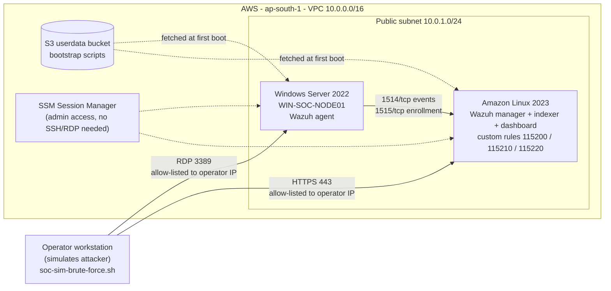
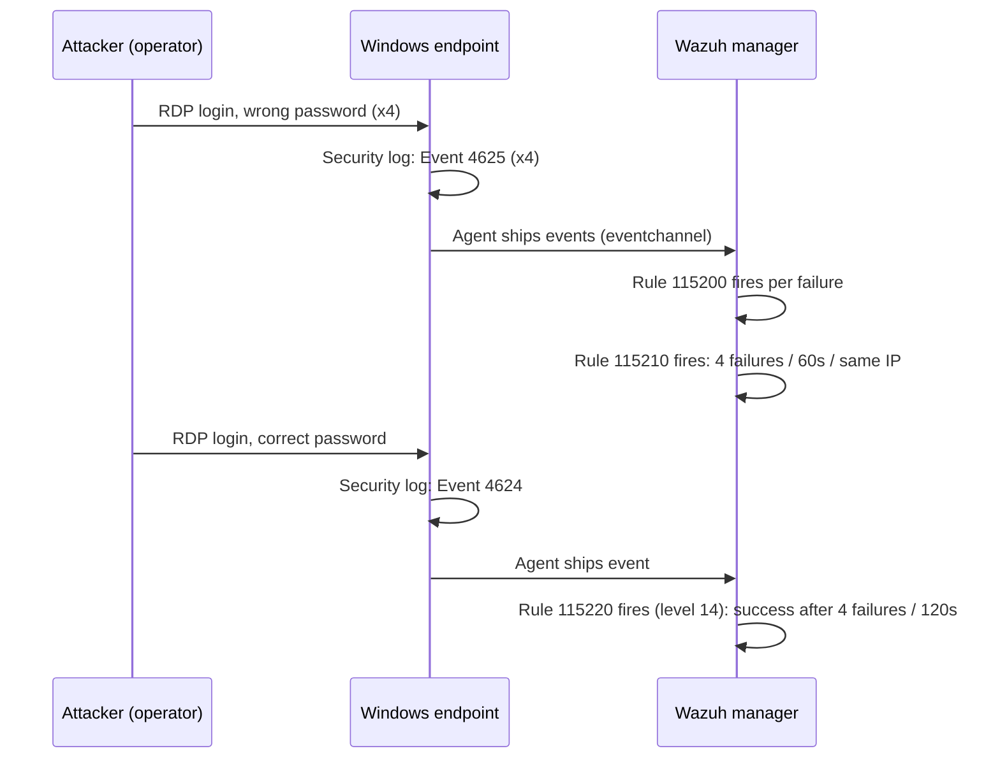

# Architecture

## Overview

Two EC2 instances in one public subnet. The Windows server is the target; the Wazuh manager is the SIEM. The operator's workstation plays the attacker.

## Detection flow

## Design decisions

| Decision | Why |
|---|---|
| **Security Groups reference each other** for agent traffic (1514/1515/55000) instead of CIDRs | The Wazuh manager only accepts agent traffic from the Windows SG. No IP bookkeeping, and nothing else in the VPC can enroll. |
| **Only the operator IP can reach RDP and the dashboard**, resolved at apply time from `icanhazip.com` | The lab never exposes a brute-forceable port to the whole internet. Trade-off: re-apply if your IP changes. |
| **Thin bootstrap shims + payloads in S3** | User-data has a 16 KB limit and is painful to debug. The Terraform-rendered shim only fetches files and sets environment variables; real logic stays in plain `.sh`/`.ps1` files. |
| **Per-instance payload hashes in user-data** | Editing a Windows script does not rebuild the Wazuh server (and vice versa), because each instance only hashes the files it consumes. |
| **Wazuh manager and agent share one `wazuh_version` variable** | Version mismatch between manager and agent is a classic source of silent failures. One variable, no drift. |
| **Windows and Linux AMIs are pinnable** | With an unpinned "latest" AMI, `terraform apply` can silently replace the instance. Pin after first apply; the bootstrap log warns while unpinned. |
| **SSM Session Manager for admin access** | No inbound SSH, no key pairs to leak. IMDSv2 required on both instances. EBS volumes encrypted. |
| **S3-native state locking** (`use_lockfile`) | Removes the need for a DynamoDB lock table (Terraform ≥ 1.10). |
| **Agent collects only events 4624 and 4625** via an XPath query | Keeps the data contract tiny and the detection deterministic. |

## Known limitations

- Single AZ, public subnet, no NAT or flow logs. This is a lab, not a reference production network. Checkov exceptions for this are documented in `terraform/lab/.checkov.yaml`.
- Containment is done by hand (Terraform change + `Disable-LocalUser`), not by Wazuh Active Response. Automating it is the obvious next step.
- Only one scenario (RDP brute force) is implemented.
