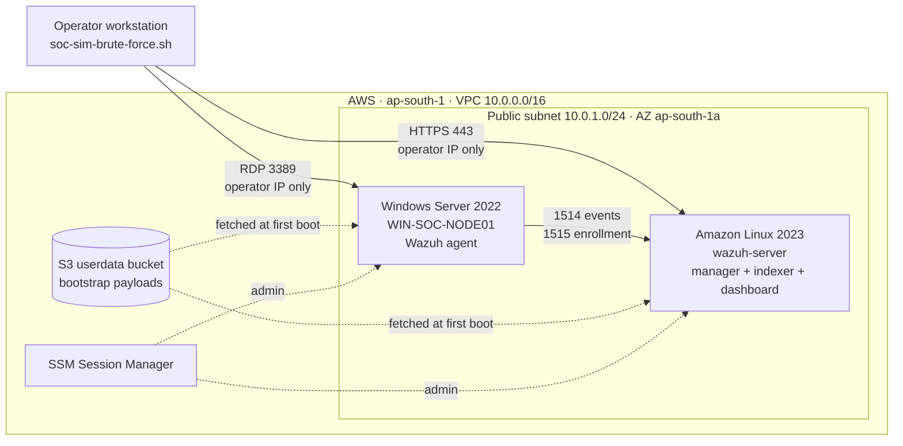
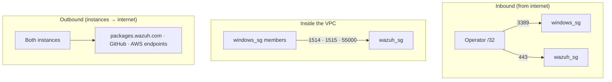
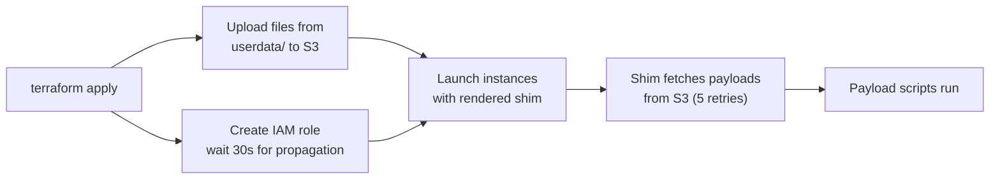
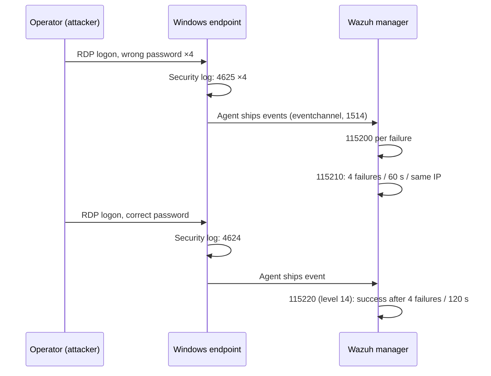

# 🏗️ Architecture

How the lab is built, how data moves through it, and where the security boundaries sit.

**Contents:** [Summary](#summary) · [Components](#components) · [Network](#network) · [Provisioning](#provisioning) · [Detection pipeline](#detection-pipeline) · [Identity & access](#identity--access) · [State & CI](#state--ci) · [Design decisions](#design-decisions) · [Limitations](#limitations)

---

## Summary

Two EC2 instances share one public subnet in a single VPC.

- **Windows Server 2022** is the target. It runs a Wazuh agent.
- **Amazon Linux 2023** is the SIEM. It runs the Wazuh manager, indexer and dashboard.
- The **operator's workstation** plays the attacker.

Everything is Terraform. Admin access is through SSM, not SSH or RDP.

---

## Components

| Component | Detail |
|---|---|
| **VPC** | `10.0.0.0/16`, DNS support and hostnames on |
| **Public subnet** | `10.0.1.0/24`, single AZ, auto-assigns public IPs |
| **Internet gateway + route table** | `0.0.0.0/0` → IGW |
| **Wazuh manager** | Amazon Linux 2023 · `m7i-flex.large` · 50 GB gp3 · encrypted |
| **Windows endpoint** | Windows Server 2022 · `c7i-flex.large` · 60 GB gp3 · encrypted |
| **Security Groups** | `wazuh_sg`, `windows_sg` (see below) |
| **IAM** | One role + instance profile shared by both instances |
| **S3 `userdata`** | Holds the scripts instances fetch at boot |
| **S3 `state`** | Terraform remote state, versioned, encrypted |

Both instances enforce **IMDSv2** (`http_tokens = required`).

---

## Network

### Security Group rules

| SG | Direction | Port | Source / Destination | Purpose |
|---|---|---|---|---|
| `windows_sg` | in | 3389/tcp | Operator IP `/32` | RDP (the attack surface) |
| `windows_sg` | out | all | `0.0.0.0/0` | Package downloads, SSM, S3 |
| `wazuh_sg` | in | 1514/tcp | `windows_sg` | Agent event stream |
| `wazuh_sg` | in | 1515/tcp | `windows_sg` | Agent enrollment |
| `wazuh_sg` | in | 55000/tcp | `windows_sg` | Wazuh API |
| `wazuh_sg` | in | 443/tcp | Operator IP `/32` | Dashboard |
| `wazuh_sg` | out | all | `0.0.0.0/0` | Package downloads, SSM, S3 |

Two things to note:

- **Agent ports reference a Security Group, not a CIDR.** Only members of `windows_sg` can reach the manager. No IP bookkeeping.
- **The operator IP is resolved at apply time** via `icanhazip.com`. If it changes, re-apply.

### Traffic paths

Nothing else is reachable from outside. There is no inbound SSH.

---

## Provisioning

Instances boot with a **thin shim** that fetches real scripts from S3. Terraform injects only configuration.

### Wazuh manager boot sequence

`bootstrap.sh.tpl` fetches payloads, then runs them in order:

1. **`linux-setup.sh`**: enable SSM agent, wait for internet, create `ssm-user`, set timezone, install utilities and shell tooling.
2. **`wazuh-setup.sh`**:
   - `dnf update`, set hostname `wazuh-server`
   - Run the all-in-one installer (`wazuh-install.sh -a -i`) for the pinned branch
   - Compare installed version to `wazuh_version` and warn on mismatch
   - Install `wazuh-local-rules.xml` into `/var/ossec/etc/rules/`
   - Extract the admin password to `/home/ssm-user/wazuh-passwords.txt` (mode 600)
   - Set the dashboard timezone through the API
   - Enable and restart indexer, manager, dashboard

### Windows endpoint boot sequence

`windows-bootstrap.ps1.tpl` installs AWS CLI v2, fetches `windows.ps1` to `C:\SOC-Lab\`, then runs it in seven steps:

| Step | Action |
|:-:|---|
| 1 | Set hostname `WIN-SOC-NODE01` (reboot at the end to apply) |
| 2 | Create `ssm-user` (random password, local admin) and pre-create its profile |
| 3 | Download and install the Wazuh agent MSI, pointing at the manager's private IP |
| 4 | Rewrite `ossec.conf` to collect only Security events 4624 and 4625 (`eventchannel`) |
| 5 | Enable Logon auditing (success + failure) |
| 6 | Create `FakeSOCUser`, add to Remote Desktop Users, enable RDP |
| 7 | Set the agent service to Automatic and restart it |

### Rebuild behavior

Each instance's `user_data` embeds the MD5 of **only the payloads it uses**.

| You change | Rebuilds |
|---|---|
| `windows.ps1` | Windows only |
| `linux-setup.sh`, `wazuh-setup.sh`, `wazuh-local-rules.xml` | Wazuh manager only |
| Any `.tpl` file | Both instances |

Both instances set `user_data_replace_on_change = true`, so a hash change means a new instance.

---

## Detection pipeline

| Stage | Where | What happens |
|---|---|---|
| Generate | Windows | Logon auditing writes events 4625 / 4624 |
| Collect | Windows agent | XPath filter forwards only those two event IDs |
| Transport | Agent → manager | TCP 1514, enrollment on 1515 |
| Analyze | Manager | Custom rules correlate by source IP |
| Store / view | Indexer + dashboard | Alerts searchable at `https://<manager>:443` |

Rule logic is documented in [`detection-rules.md`](detection-rules.md).

---

## Identity & access

| Principal | Access | Notes |
|---|---|---|
| EC2 role `terraform-ec2-ssm-role` | `AmazonSSMManagedInstanceCore` + `s3:GetObject` on the userdata bucket | Read-only, scoped to one bucket |
| `ssm-user` (Linux) | Passwordless sudo | Created by `linux-setup.sh` |
| `ssm-user` (Windows) | Local Administrator, random 24-char password | Reached via SSM, never by password |
| `FakeSOCUser` | Remote Desktop Users, **known password** | Lab credential, intentionally weak |
| Operator | AWS credentials for Terraform, SSM for hosts | No key pairs exist |

---

## State & CI

### Terraform layout

| Module | Backend | Manages |
|---|---|---|
| `terraform/bootstrap` | local | State bucket, userdata bucket (both encrypted, public access blocked; state is versioned) |
| `terraform/lab` | S3, `use_lockfile = true` | Network, compute, IAM, S3 objects |

The bootstrap module exists because the lab's backend and userdata bucket must exist before the lab can run. Bucket names must be kept in sync across `bootstrap/s3.tf`, `lab/backend.tf` and `lab/variables.tf`, since backends cannot use variables.

### CI (GitHub Actions)

| Job | Runs |
|---|---|
| `validate` (matrix: bootstrap, lab) | `terraform fmt -check` → `init -backend=false` → `validate` |
| `security-scan` | Checkov on `terraform/`, non-blocking, skips listed in `terraform/lab/.checkov.yaml` |

---

## Design decisions

| Decision | Reason |
|---|---|
| SG-to-SG rules for agent traffic | Only `windows_sg` members can enroll. No CIDR upkeep. |
| RDP and dashboard limited to operator IP | A brute-forceable port is never open to the internet. |
| Thin shims, logic in S3 payloads | User-data has a 16 KB limit and is hard to debug. Plain scripts are easier. |
| Per-instance payload hashes | Editing one OS's script does not rebuild the other box. |
| One `wazuh_version` variable | Manager and agent cannot drift apart. |
| Pinnable AMIs | Unpinned "latest" can silently replace an instance on apply. |
| SSM instead of SSH/RDP for admin | No inbound admin ports, no keys. |
| S3-native state locking | No DynamoDB table needed (Terraform ≥ 1.10). |
| Collect only events 4624 / 4625 | Small, deterministic data contract for the rules. |

---

## Limitations

- **Single AZ, public subnet, no NAT, no VPC flow logs.** Lab topology, not a production reference. Related Checkov skips are in `.checkov.yaml`.
- **Containment is manual** (Terraform change or AWS CLI, plus `Disable-LocalUser`). Wazuh Active Response is the natural next step. In the recorded run, removing the ingress block in Terraform did not remove the live rule, so the AWS CLI was used (see [`incident-report.md`](incident-report.md)).
- **One scenario** is implemented (RDP brute force).
- **Wide egress.** Both Security Groups allow all outbound traffic.

---

📎 Related: [`detection-rules.md`](detection-rules.md) · [`incident-report.md`](incident-report.md) · [`lessons-learned.md`](lessons-learned.md)
