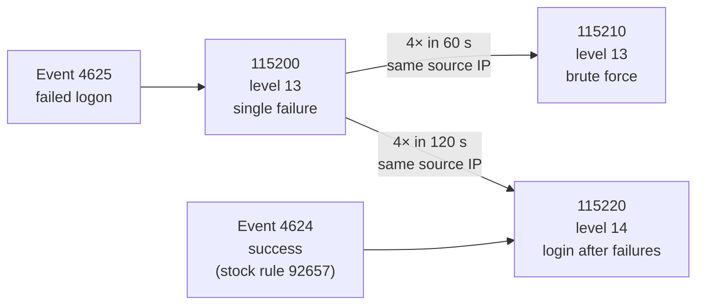

# 🎯 Detection Rules

Three custom Wazuh rules that turn raw Windows logon events into an escalating RDP brute-force signal.

| | |
|---|---|
| **Rule file** | [`terraform/lab/userdata/wazuh-local-rules.xml`](../terraform/lab/userdata/wazuh-local-rules.xml) |
| **Rule IDs** | `115200` · `115210` · `115220` |
| **Log source** | Windows **Security** channel, `eventchannel` |
| **Events** | `4625` failed logon · `4624` successful logon |
| **MITRE ATT&CK** | [T1110](https://attack.mitre.org/techniques/T1110/) Brute Force · [T1078](https://attack.mitre.org/techniques/T1078/) Valid Accounts |

---

## 💡 The idea

Confidence rises with each step, and so does the alert level.

| Observation | Meaning | Level |
|---|---|:-:|
| One failed login | Noise | 13 |
| Four failures from one IP in a minute | Attack in progress | 13 |
| A **success** from that IP right after | Probable compromise | **14** |

---

## 📖 Rule by rule

### `115200`: individual failed logon

| | |
|---|---|
| **Level** | 13 |
| **Parent** | `60122` (stock Wazuh: Windows logon failure) |
| **Extra filter** | `win.eventdata.logonType` matches `2`, `3` or `10` |
| **Groups** | `authentication_failed`, `windows_bruteforce` |
| **MITRE** | T1110 |

Purpose: give every failure one stable rule ID that the correlation rules can count.

The logon-type filter covers interactive (2), network (3) and RemoteInteractive (10). It keeps service and batch-job failures from inflating the count.

---

### `115210`: brute-force correlation

| | |
|---|---|
| **Level** | 13 |
| **Trigger** | `frequency="4"` within `timeframe="60"` on rule `115200` |
| **Grouping** | `same_field` = `win.eventdata.ipAddress` |
| **Groups** | `authentication_failed`, `bruteforce`, `windows` |
| **MITRE** | T1110 |

Purpose: collapse repeated failures into one actionable alert.

Grouping is by **source IP, not username**. That catches one host hammering one account, and also one host spraying many accounts.

---

### `115220`: successful login after failures

| | |
|---|---|
| **Level** | **14** (highest of the three) |
| **Parent** | `92657` (stock Wazuh: successful remote logon) |
| **Trigger** | `if_matched_sid` `115200`, `frequency="4"` within `timeframe="120"` |
| **Grouping** | `same_field` = `win.eventdata.ipAddress` |
| **Groups** | `authentication_success`, `possible_compromise`, `windows` |
| **MITRE** | T1110, T1078 |

Purpose: flag probable compromise at the moment the guess works. This is the alert to act on first.

The window is 120 s, wider than `115210`'s 60 s, so an attacker who pauses before the winning attempt is still caught.

---

## 🔬 What it looks like when it fires

From [evidence 02](../evidence/02-wazuh-correlation-alerts.png), agent `WIN-SOC-NODE01`, one simulation run (dashboard time, IST):

| Time | Rule | Level | Event |
|---|:-:|:-:|:-:|
| 13:44:55 | `115200` | 13 | 4625 |
| 13:44:58 | `115200` | 13 | 4625 |
| 13:45:01 | `115200` | 13 | 4625 |
| 13:45:03 | **`115210`** | 13 | 4625 |
| 13:45:06 | **`115220`** | **14** | 4624 |

Four failures produce three `115200` alerts and one `115210`. The fourth failure surfaces as the correlation alert. The success alert lands about three seconds later.

---

## 🧪 Reproducing it

**Against the lab**

`simulation/soc-sim-brute-force.sh` sends 4 wrong passwords and then 1 correct one for `FakeSOCUser`, using FreeRDP in `+auth-only` mode.

| Setting | Value | Why |
|---|---|---|
| Spacing | 2 s sleep between attempts | Keeps all four failures inside the 60 s window |
| Mode | NLA, `+auth-only` | Produces real 4625 / 4624 events without opening a session |
| Pass/fail signal | Windows Security events | FreeRDP's exit code is not reliable (see [lessons](lessons-learned.md)) |

**Without the network**

Paste sample events into `/var/ossec/bin/wazuh-logtest` on the manager.

---

## 🔧 Known gaps and tuning

| Gap | Detail | Possible fix |
|---|---|---|
| **Blank count in alert text** | The `$(frequency)` placeholder renders empty in the dashboard. Detection is unaffected. | Reword the description without that placeholder. `frequency` is likely not an event field. |
| **False positives** | A user who mistypes four times in a minute trips `115210`. | Tune thresholds per environment. Exclude known scanners and service accounts. |
| **Single-source assumption** | Grouping by IP misses distributed attacks where each source stays under the threshold. | Add a per-account failure rule. |
| **Logon types** | Only types 2, 3 and 10 are matched. | Intentional for this scenario. Extend per use case. |
| **No automated response** | Rules alert and a human contains. | Wazuh Active Response on `115220`. |

Containment steps are in [`evidence/README.md`](../evidence/README.md). A full walkthrough of the recorded run is in [`incident-report.md`](incident-report.md).
