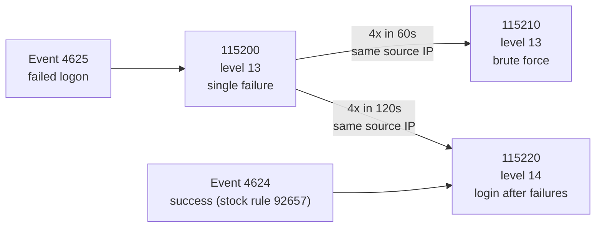

# Detection rules: 115200 / 115210 / 115220

Source: [`terraform/lab/userdata/wazuh-local-rules.xml`](../terraform/lab/userdata/wazuh-local-rules.xml)
Coverage: MITRE ATT&CK **T1110** (Brute Force) and **T1078** (Valid Accounts)
Log source: Windows **Security** channel, events **4625** (failed logon) and **4624** (successful logon)

## The idea in one paragraph

A single failed login is noise. Four failed logins from one address in a minute is an attack in progress. A *successful* login from that same address right after is a probable compromise. The three rules build on each other so the alert level rises as confidence rises.

## Rule by rule

### 115200: individual failed logon (level 13)

| | |
|---|---|
| Parent | `60122` (stock Wazuh rule for Windows logon failure) |
| Extra filter | `logonType` is `2`, `3` or `10` (interactive, network, RemoteInteractive) |
| Purpose | Normalize failures into one rule ID that the correlation rules can count |
| Groups / MITRE | `authentication_failed`, `windows_bruteforce` / T1110 |

Filtering on logon type keeps out failures from unrelated mechanisms (service logons, batch jobs) that would otherwise inflate the count.

### 115210: brute-force correlation (level 13)

| | |
|---|---|
| Trigger | `frequency="4"` `timeframe="60"` on rule 115200 |
| Grouping | `same_field` = `win.eventdata.ipAddress`: the four failures must share a **source IP** |
| Purpose | Turn repeated failures into a single, actionable alert |

Grouping by source IP (not by username) is deliberate: it catches one host hammering one account *and* one host spraying many accounts.

### 115220: successful login after failures (level 14, highest)

| | |
|---|---|
| Trigger | Successful remote logon (stock rule `92657`) **and** 4 prior 115200 events within 120 s from the same IP |
| Purpose | Flag probable compromise, the moment the attacker's guess works |
| Groups / MITRE | `authentication_success`, `possible_compromise` / T1110 + T1078 |

This is the rule an analyst should act on first. The 120 s window is wider than 115210's 60 s so a slow attacker who pauses before the successful attempt is still caught.

## What it looks like when it fires

From [`evidence/02`](../evidence/02-wazuh-correlation-alerts.png), agent `WIN-SOC-NODE01`, one run of the simulation (times are the dashboard's, IST):

| Time | Rule | Level | Event |
|---|---|---|---|
| 13:44:55 | 115200 | 13 | 4625 |
| 13:44:58 | 115200 | 13 | 4625 |
| 13:45:01 | 115200 | 13 | 4625 |
| 13:45:03 | **115210** | 13 | 4625 |
| 13:45:06 | **115220** | **14** | 4624 |

The correlation rule fires on the fourth failure, and the success alert lands three seconds later.

## Reproducing it

`simulation/soc-sim-brute-force.sh` sends 4 wrong passwords then 1 correct one for `FakeSOCUser` using FreeRDP in auth-only mode (`+auth-only`), 2 seconds apart. That spacing keeps all four failures inside the 60-second window.

To test the rules without the network, paste sample events into `/var/ossec/bin/wazuh-logtest` on the manager.

## Known gaps and tuning notes

- **Description shows a blank count.** The alert text is meant to read "RDP brute force - *4* failures from …", but in the dashboard the `$(frequency)` placeholder renders empty (visible in the screenshot). The detection is unaffected; the description template needs fixing.
- **False positives.** A user who mistypes a password four times in a minute trips 115210. In production I'd tune the threshold per environment, and exclude known scanners and service accounts.
- **Single-source assumption.** Grouping by IP misses a distributed attack where each source stays under the threshold. That needs a per-account rule as a complement.
- **Logon types.** Only types 2/3/10 are matched. Other types are deliberately out of scope for this scenario.
- **No automated response.** The rules alert; a human contains. See the containment steps in [`evidence/README.md`](../evidence/README.md).
