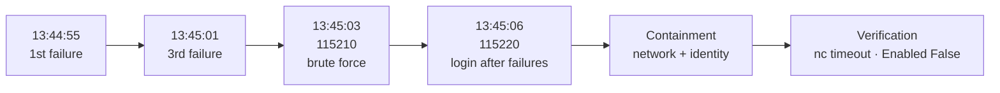
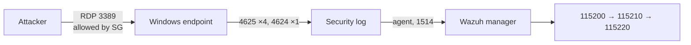

# 🚨 Incident Report: RDP Brute Force with Successful Login

> **Exercise record.** This was a controlled simulation in a lab environment. The attacker is the operator's own workstation, and the target account (`FakeSOCUser`) exists only for this exercise. The report is written as if it were a real incident to practice the format.

---

## 📋 At a glance

| | |
|---|---|
| **Date** | 29 Sep 2026 (times below are dashboard time, IST) |
| **Type** | Credential access: brute force followed by valid-account use |
| **MITRE ATT&CK** | [T1110](https://attack.mitre.org/techniques/T1110/) Brute Force · [T1078](https://attack.mitre.org/techniques/T1078/) Valid Accounts |
| **Affected asset** | `WIN-SOC-NODE01` (Windows Server 2022) |
| **Affected account** | `FakeSOCUser` (local, Remote Desktop Users) |
| **Source** | Operator workstation public IP (redacted) |
| **Highest alert** | Rule `115220`, level 14 |
| **Status** | ✅ Contained and verified |

---

## 🧭 Summary

Four failed RDP logons followed by one successful logon reached the Windows endpoint from a single source IP in about 11 seconds. Wazuh correlated the events into three escalating alerts, ending with rule `115220`, which flags a successful login that follows repeated failures. That alert is the signal of a probable compromise.

Containment had two parts: the RDP ingress rule was removed from the Security Group, and the account was disabled. Both were checked independently afterwards.

---

## ⏱️ Timeline

All detection times come from the Wazuh dashboard ([evidence 02](../evidence/02-wazuh-correlation-alerts.png)).

| Time (IST) | Event | Source |
|---|---|---|
| 13:44:55.741 | Failed logon #1. Rule `115200`, level 13 | Event 4625 |
| 13:44:58.787 | Failed logon #2. Rule `115200`, level 13 | Event 4625 |
| 13:45:01.410 | Failed logon #3. Rule `115200`, level 13 | Event 4625 |
| 13:45:03.937 | Failed logon #4 triggers the brute-force correlation. Rule **`115210`**, level 13 | Event 4625 |
| 13:45:06.509 | Successful logon from the same source. Rule **`115220`**, level **14** | Event 4624 |
| Not recorded | RDP ingress rule removed | [evidence 03](../evidence/03-windows-sg-after.png) |
| Not recorded | Port 3389 probe times out | [evidence 04](../evidence/04-verification-rdp-blocked.png) |
| Not recorded | `FakeSOCUser` disabled and checked | [evidence 05](../evidence/05-verification-user-disabled.png) |

**Key intervals**

| Interval | Duration |
|---|---|
| First failure → brute-force alert | ≈ 8 s |
| First failure → compromise alert | ≈ 11 s |
| Brute-force alert → compromise alert | ≈ 2.6 s |

Containment timestamps were not captured during the run, so detect-to-contain time cannot be stated. See [action items](#-action-items).

---

## 🔍 Detection

| Rule | Level | Meaning |
|---|:-:|---|
| `115200` | 13 | One failed logon (types 2, 3, 10) |
| `115210` | 13 | 4 failures from one IP within 60 s |
| `115220` | **14** | Successful logon after 4 failures from one IP within 120 s |

The alerts escalate in the order an analyst would want. The first two say "attack in progress", and the third says "attack may have worked." Rule details are in [`detection-rules.md`](detection-rules.md).

---

## 🛠️ Analysis

**What the evidence shows**

- Five authentication events came from one source IP in about 11 seconds.
- Four used a wrong password for `FakeSOCUser` and the fifth used the correct one.
- The pattern matches a guessing attack that succeeded.

**What it does not show**

- The simulation uses FreeRDP in `+auth-only` mode, so credentials were validated but no interactive session was opened. In a real incident, the next questions would be what the account did after the 4624 event, and whether other logons or processes followed.
- Only events 4624 and 4625 are collected by the agent. Post-logon activity would be invisible with this configuration.

**Attack path**

---

## 🧯 Containment

Two layers, in this order.

| # | Layer | Action | Why this order |
|:-:|---|---|---|
| 1 | **Network** | Removed the RDP (3389) ingress rule from the Windows Security Group | Cuts the attack path regardless of which account is targeted |
| 2 | **Identity** | `Disable-LocalUser -Name "FakeSOCUser"` | Stops the known-compromised credential from being used by any other path |

---

## ✅ Verification

Each action was confirmed separately, not assumed from the command succeeding.

| Check | Command | Result |
|---|---|---|
| Port closed | `nc -vz -w 5 <windows-ip> 3389` | `TIMEOUT` ([04](../evidence/04-verification-rdp-blocked.png)) |
| Account disabled | `Get-LocalUser -Name "FakeSOCUser" \| Select Name, Enabled` | `Enabled : False` ([05](../evidence/05-verification-user-disabled.png)) |

> **Evidence caveat.** Images 01 and 03 are views of the Terraform source before and after the change. They show intent, not the live Security Group. The `nc` timeout (image 04) is what proves the port is closed. This matters because of the issue below.

---

## 🧩 Contributing factors

| Factor | Detail |
|---|---|
| **Exposed service** | RDP was reachable from the internet, limited to one IP. This is the surface the attack used. |
| **Weak credential** | `FakeSOCUser` has a fixed, known password by design. |
| **No lockout** | Nothing in the lab limits failed attempts per account, so four wrong guesses followed by a right one all went through. |
| **Detection only** | Rules alert but do not respond. A human performed containment. |

---

## 📈 What went well, and what didn't

| ✅ Went well | ⚠️ Needs work |
|---|---|
| All three rules fired in the right order | The `115210` and `115220` alert text shows a blank where the failure count should be |
| Compromise alert arrived ~3 s after the success event | Terraform did not remove the live `3389` rule as expected; it was removed with the AWS CLI |
| Both containment actions were independently verified | Containment timestamps were not recorded |
| Rules grouped by source IP, so the same source tied the events together | Only 4624/4625 are collected, so there is no view of what happens after logon |

---

## 📌 Action items

| # | Action | Type | Priority |
|:-:|---|---|:-:|
| 1 | Fix the blank count in the `115210` / `115220` descriptions | Detection | High |
| 2 | Find out why `terraform plan` showed no change while the `3389` rule was still attached, then update the containment runbook | Process | High |
| 3 | Record timestamps for every containment step so detect-to-contain time can be measured | Process | Medium |
| 4 | Automate containment with Wazuh Active Response (disable account on `115220`) | Response | Medium |
| 5 | Add a per-account failure rule to cover distributed attempts that stay under the per-IP threshold | Detection | Medium |
| 6 | Collect post-logon events (e.g. 4672 special privileges, 4688 process creation) | Visibility | Low |

---

## 🔎 Indicators

| Type | Value |
|---|---|
| Windows events | `4625` ×4, then `4624` ×1 |
| Account | `FakeSOCUser` |
| Logon types matched | 2, 3, 10 |
| Source | Operator workstation public IP (redacted) |
| Wazuh rules | `115200`, `115210`, `115220` (stock parent `92657`) |

---

## 🗂️ References

- Detection logic: [`detection-rules.md`](detection-rules.md)
- Infrastructure: [`architecture.md`](architecture.md)
- Debugging notes: [`lessons-learned.md`](lessons-learned.md)
- Screenshots: [`../evidence/`](../evidence/README.md)
- Attack script: [`../simulation/soc-sim-brute-force.sh`](../simulation/soc-sim-brute-force.sh)
