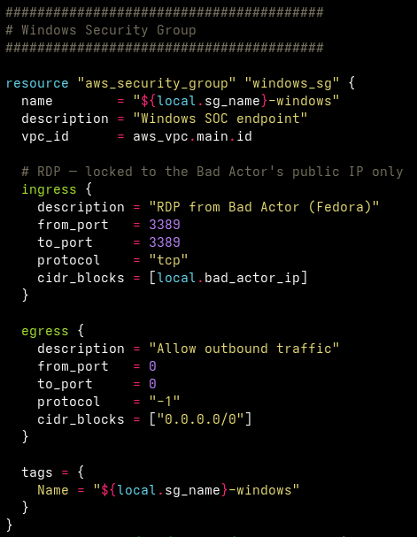
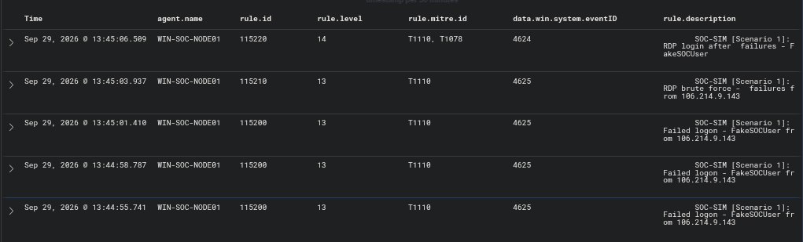
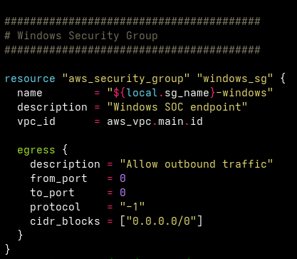
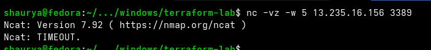
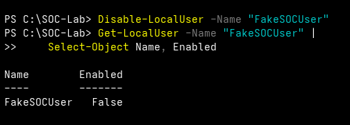

# 🧾 Evidence

Five screenshots covering the full loop. Each answers one question.

---

## 🖼️ Screenshots

### 1 · Before: the exposure



The Terraform definition of the Windows Security Group allows RDP (3389) from exactly one address, the operator's. This is the path the simulation uses. (A source view, not a live console capture.)

---

### 2 · Detection: rules fire



Wazuh raised rule `115200` (×3), `115210` (brute force) and `115220` (login after failures, level 14) for agent `WIN-SOC-NODE01`, mapped to T1110 / T1078.

---

### 3 · Containment (network)



The RDP ingress block is gone from the Terraform definition, leaving only the egress rule. This shows intent. Image 4 is what proves the live port is closed.

---

### 4 · Verification: port closed



A TCP probe to 3389 times out. The fix is confirmed, not assumed.

---

### 5 · Containment (identity)



`FakeSOCUser` shows `Enabled : False`.

---

## 🔁 Reproducing the containment

**Network**

```bash
# Remove the `ingress { ... 3389 ... }` block in terraform/lab/vpc.tf, then:
cd terraform/lab
terraform apply

# Verify (expect a timeout)
nc -vz -w 5 "$(terraform output -raw windows_public_ip)" 3389
```

> In the recorded run, `terraform plan` showed no change while the `3389` rule was still attached, so the rule was removed with the AWS CLI instead and then verified. Always confirm the live Security Group, not just the plan. Details in [`docs/lessons-learned.md`](../docs/lessons-learned.md) and the [incident report](../docs/incident-report.md).

**Identity** (run on the Windows endpoint via SSM Session Manager)

```powershell
Disable-LocalUser -Name "FakeSOCUser"
Get-LocalUser -Name "FakeSOCUser" | Select-Object Name, Enabled
```

---

## 🔒 Before publishing these images

Two public IPs appear in the screenshots:

| IP | Where | Sensitivity |
|---|---|---|
| Operator workstation | Wazuh alerts (image 2) | Your real ISP address. Consider blurring. |
| Windows instance | `nc` output (image 4) | Ephemeral. Low risk. |
